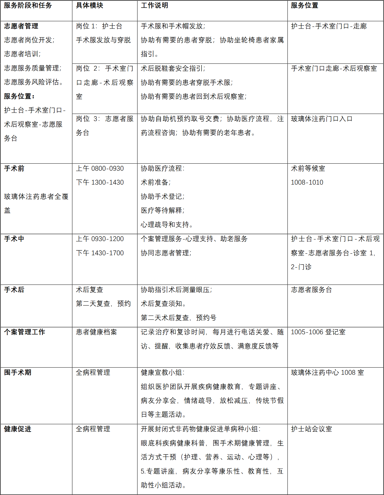
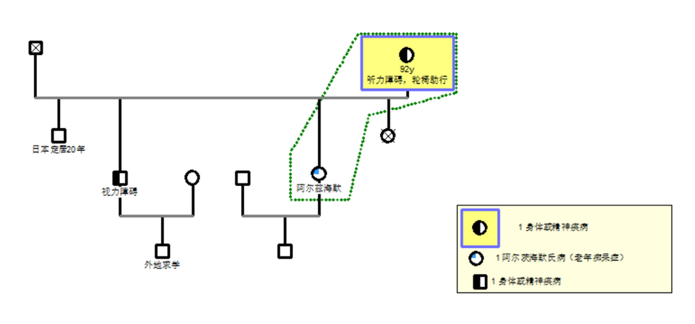

# 医务社工+志愿者 助力眼科老年患者服务的参与式行动研究

    导师：罗家德 陈洪涛
    作者：陈继艳
    学号：2022213375
    学科专业：社会工作
    提交日期：2026 年 4 月 4 日

## 摘要

随着我国人口老龄化进程加快，北京市已进入中度老龄化社会，老年眼科疾病（尤其是白内障）高发，老年患者因视力障碍、行动不便、记忆力衰退及数字化操作能力不足，面临严峻的就医困境。在医学模式向“生理—心理—社会”一体化转变的背景下，老年眼科患者的治疗不仅需要专业医疗服务，更需要就医协助、健康指导、心理疏导及资源链接等支持。医务社工与志愿者的双工联动模式，能够有效填补医护人员在患者社会心理服务方面的空白。

本研究采用参与式行动研究方法，以.北京 T 医院眼科老年患者为研究对象，通过需求调研、门诊跟诊、深度陪诊、案例分析等方式，系统梳理老年眼科患者的核心需求，构建“医务社工+志愿者”双工联动服务模式，并通过实务实践验证模式的可行性与有效性。研究明确了老年眼科患者在就医协助、情绪疏导、健康指导、资源链接四大方面的核心需求，据此制定了全流程陪诊、多元心理支持、分层健康宣教、多元资源协同等针对性行动策略，并建立了人员、制度、资源三大保障体系。研究通过个案工作、小组工作、社区服务、志愿者管理等实务实践，累计开展深度陪诊10 人次/日，服务老年患者若干，研发志愿服务规范手册，链接公益资源 8 万元，形成了可复制、可推广的“医务社工+志愿者”双工联动服务模式。研究为老年眼科专科医务社会工作的专业化、本土化发展提供了实践参考，也为改善老年眼科患者就医体验提供实务经验。

关键词：医务社工；志愿者；老年眼科患者；参与式行动研究；双工联动

## 大纲

1. [绪论](#第一章 绪论)
2. [国内外研究综述](#第二章 国内外研究综述)
3. [核心概念与理论基础](#第三章 核心概念与理论基础)
4. [研究目的、内容与预期成果](#第四章 研究目的、内容与预期成果)
5. [研究方法与研究设计](#第五章 研究方法与研究设计)
6. [老年眼科患者需求评估与分析](#第六章 老年眼科患者需求评估与分析)
7. [医务社工+志愿者双工联动服务实务](#第七章 医务社工+志愿者双工联动服务实务实施)
8. [服务成效评估与反思](#第八章 服务成效评估)
9. [结论与展望](#第九章 服务实施过程中的问题与反思)
10. [附录](#附录)
11. [参考文献](#参考文献)

## 目录

- [摘要](#摘要)
- [大纲](#大纲)
- [第一章 绪论](#第一章 绪论)
    1. [研究背景](#1.1 研究背景)
    2. [研究意义](#1.2 研究意义)
        1. [理论意义](#1.2.1 理论意义)
        2. [实践意义](#1.2.2 实践意义)
    3. [研究思路与研究框架](#1.3 研究思路与研究框架)
        1. [研究思路](#1.3.1 研究思路)
        2. [研究框架](#1.3.2 研究框架)
- [第二章 国内外研究综述](#第二章 国内外研究综述)
    1. [国内研究现状](#2.1 国内研究现状)
    2. [国外研究现状](#2.2 国外研究现状)
    3. [研究述评](#2.3 研究述评)
- [第三章 核心概念与理论基础](#第三章 核心概念与理论基础)
    1. [核心概念](#3.1 核心概念)
        1. [医务社会工作](#3.1.1 医务社会工作)
        2. [医务社工](#3.1.2 医务社工)
        3. [医院志愿者](#3.1.3 医院志愿者)
        4. [社会工作职业道德](#3.1.4 社会工作职业道德)
        5. [参与式行动研究](#3.1.5 参与式行动研究)
    2. [理论基础](#3.2 理论基础)
        1. [全人照顾理论](#3.2.1 全人照顾理论)
        2. [社会支持理论](#3.2.2 社会支持理论)
        3. [优势视角理论](#3.2.3 优势视角理论)
    3. 
- [第四章 研究目的、内容与预期成果](#第四章 研究目的、内容与预期成果)
    1. [研究目的](#4.1 研究目的)
    2. [研究内容](#4.2 研究内容)
    3. [预期成果](#4.3 预期成果)
        1. [实务工作成果](#4.3.1 实务工作成果)
        2. [研发产出成果](#4.3.2 研发产出成果)
        3. [研究成果](#4.3.3 研究成果)
- [第五章 研究方法与研究设计](#第五章 研究方法与研究设计)
    1. [研究方法选择与论证](#5.1 研究方法选择与论证)
        1. [研究方法选择](#5.1.1 研究方法选择)
        2. [研究方法论证](#5.1.2 研究方法论证)
    2. [研究对象](#5.2 研究对象)
    3. [研究流程与日程安排](#5.3 研究流程与日程安排)
        1.[研究流程](#5.3.1 研究流程)
        2.[具体研究日程](#5.3.2 具体研究日程)
    4. [研究伦理](#5.4 研究伦理)
- [第六章 老年眼科患者需求评估与分析](#第六章 老年眼科患者需求评估与分析)
    1. [评估背景与目的](#6.1 评估背景与目的)
    2. [评估方法与过程](#6.2 评估方法与过程)
        1. [评估方法](#6.2.1 评估方法)
        2. [评估过程](#6.2.2 评估过程)
    3. [眼科-白内障诊疗医学三基本分析](#6.3 眼科-白内障诊疗医学三基本分析)
        1. [基本流程](#6.3.1 基本流程)
        2. [基本费用](#6.3.2 基本费用)
        3. [基本预后](#6.3.3 基本预后)
    4. [深度陪诊案例分析](#6.4 深度陪诊案例分析)
        1. [ 就医协助需求](#6.4.1 就医协助需求（核心优先级最高）)
        2. [情绪疏导需求（易被忽视但关键）](#6.4.2 情绪疏导需求（易被忽视但关键）)
        3. [健康指导需求（全流程持续性需求）](#6.4.3 健康指导需求（全流程持续性需求）)
    5. [需求评估结论](#6.5 需求评估结论)
- [第七章 医务社工+志愿者双工联动服务实务实施](#第七章 医务社工+志愿者双工联动服务实务实施)
    1. [服务实施前期准备](#7.1 服务实施前期准备)
        1. [管理团队](#7.1.1 管理团队)
        2. [品牌建设](#7.1.2 品牌建设)
        3. [岗位开发](#7.1.3 岗位开发)
        4. [制度流程工作表](#7.1.4 制度流程工作表)
    2. [志愿者的招、考、训、用](#7.2 志愿者的招、考、训、用)
        1. [志愿者招募](#7.2.1 志愿者招募)
        2. [志愿者考核](#7.2.2 志愿者考核)
        3. [志愿者培训](#7.2.3 志愿者培训)
        4. [志愿者管理](#7.2.4 志愿者管理)
    3. [核心服务内容与实施过程](#7.3 核心服务内容与实施过程)
        1. [服务方案制定](#7.3.1 服务方案制定)
            1. [（一）个案工作](#（一）个案工作)
            2. [（二）小组工作](#（二）小组工作)
            3. [（三）社区工作](#（三）社区工作)
            4. [（四）主题活动](#（四）主题活动)
            5. [（五）研发产出](#（五）研发产出)
            6. [（六）资源链接](#（六）资源链接)
    4. [服务实施过程中的调整与优化](#7.4 服务实施过程中的调整与优化)
- [第八章 服务成效评估](#第八章 服务成效评估)
    1. [评估目的与评估方法](#8.1 评估目的与评估方法)
    2. [评估内容与评估结果](#8.2 评估内容与评估结果)
        1. [评估内容](##8.2.1 评估内容)
        2. [评估结果](#8.2.2 评估结果)
- [第九章 服务实施过程中的问题与反思](#第九章 服务实施过程中的问题与反思)
    1. [服务实施过程中存在的主要问题](#9.1 服务实施过程中存在的主要问题)
        1. [志愿者团队可持续性挑战](#9.1.1 志愿者团队可持续性挑战)
        2. [服务运营保障不足](#9.1.2 服务运营保障不足)
        3. [行业环境与政策制约](#9.1.3 行业环境与政策制约)
        4. [模式复制与推广难题](#9.1.4 模式复制与推广难题)
- [附录](#附录)
    1. [附录一 白内障中心诊疗流程](#附录一 白内障中心诊疗流程)
        1. [取号就诊](#取号就诊)
        2. [术前检查](#术前检查)
        3. [手术复查](#手术复查)
    2. [附录二 个案工作](#附录二 个案工作)
        1. [案例一](#案例一)
        2. [案例二 ](#案例二 )
        3. [案例三](#案例三)
- [参考文献](#参考文献)

## 第一章 绪论

### 1.1 研究背景

随着老龄化趋势持续加深，中国成为全球老年人口最多的国家，作为超一线城市的北京，。北京市 2023 年 60 岁及以上常住人口为 494.8 万人，占常住总人口的 22.6%，已迈入中度老龄化社会。伴随老龄化进程，人口向老龄端偏移，老年人的慢性、退行性疾病发生率显著上升，医疗卫生需求持续增长。

党中央、国务院高度重视老年健康服务工作，2021 年先后印发《国家应对人口老龄化中长期规划》等系列文件，明确提出要提供全病程慢病管理服务，重点改善老年人就医服务体验。眼部疾病作为老年群体高发的慢性疾病疾病，主要包括白内障、眼底病是老年致盲的主要原因，其发病率随年龄增长显著提升，60 岁以上老年群体白内障发病率超过 50%。2021 年某公立医院眼科老年患者的 1995 份病例研究显示老年患者的平均年龄(72.26±7.29)岁。

老年眼科患者具有鲜明的群体特征：一方面，视力障碍、行动不便、记忆力衰退等生理机能下降，导致其就医过程中易出现迷路、延误就诊等问题；另一方面，信息化时代下，医院非急诊全面预约挂号、移动端 APP 操作、自助机办理流程等数字化就医模式，使老年患者面临“不会用、不敢用、不能用”的数字化鸿沟，独自就诊困难重重。此外，眼科疾病患者需短期频繁到院就医，面对复杂的诊疗流程，易产生焦虑、抑郁等负面情绪，而医护人员因繁重的医疗工作，难以兼顾患者的社会心理需求，亟需专业力量补充。

北京 T 医院作为以眼科为国家重点专科的三级甲等综合医院，其眼科是国内一流、具有国际影响力的大型白内障诊疗中心，是北京及全国各地的老年眼科患者就诊的聚集地。针对白内障门诊老年患者集中、需求突出的特点，医院社工部链接社会资源，组建“爱暮同行”志愿服务队，为老年患者提供导医导诊、关心关爱等服务，为本次参与式行动研究的开展提供了良好的实践平台。

### 1.2 研究意义

#### 1.2.1 理论意义

随着老年眼科患者的心理—社会需求日益提升，医学模式也从“生物医学模式”向“生理—心理—社会医学模式”转变。如何从“身—心—社—灵”出发，为老年眼科患者提供入院前、住院期间、出院后的全病程干预，是当前医务社会工作的重要课题。医务社会工作在患者社会资源链接、心理支持、医患关系调适等方面具有专业优势，而“医务社工+志愿者”双工联动模式，能够有效发挥医务社工的专业优势和志愿者的人数优势。本研究通过参与式行动研究方法，聚焦老年眼科专科领域，探索“医务社工+志愿者”双工联动服务模式的构建与实施路径，。同时，本研究将行动研究方法与医务社工实务相结合，进一步探索了行动研究在医务社工领域的应用。

#### 1.2.2 实践意义

当前，国内医务社会工作的专科化发展仍处于初级阶段，针对老年眼科患者的“医务社工+志愿者”双工联动实务研究较为匮乏。本研究以北京 T 医院眼科为实践基地，通过需求评估、实务干预、成效反思等环节，构建了针对性的双工联动服务模式，有效解决了老年眼科患者的就医困境，改善了患者的就医体验和满意度。

本研究的实践成果的可复制、可推广性，能够为国内其他医院开展老年眼科专科医务社工服务提供实践参考，推动专科医务社会工作的本土化发展。同时，通过实务实践，能够提升医务社工的专业能力，规范志愿者管理，促进医院人文服务水平的提升，引发政府和社会对医务社会工作发展的关注，推动医务社会工作的职业化进程，为推进健康老龄化、构建老年友好型社会提供实践支撑。

### 1.3 研究思路与研究框架

#### 1.3.1 研究思路

本研究采用参与式行动研究方法，以“需求评估—方案设计—实务实施—反思优化”为核心思路，立足北京 T 医院眼科老年患者的实际需求，首先，通过文献研究梳理国内外相关服务现状，明确概念与理论基础；其次，通过需求调研、门诊跟诊、深度陪诊等方式，系统评估老年眼科患者的核心需求；再次，基于需求评估结果，设计双工联动服务方案，开展个案工作、小组工作、社区服务等实务干预；最后，通过成效评估与反思，优化服务方案，形成可复制、可推广的服务模式，完成研究结论与展望。

#### 1.3.2 研究框架

本论文共分为 9 章，具体框架如下：

第一章为绪论，阐述研究背景和意义、研究思路和框架；

第二章为国内外研究综述，梳理国内外医务社会工作、医院志愿服务及老年眼科患者服务相关研究现状；

第三章为核心概念与理论基础，明确医务社工、志愿者、参与式行动研究等核心概念，阐述相关理论支撑；

第四章为研究目的、内容与预期成果，明确研究核心目标与具体产出；

第五章为研究方法与研究设计，说明研究方法的选择与论证、研究对象、研究流程等；

第六章为老年眼科患者需求评估与分析，通过调研与案例分析，总结患者核心需求；

第七章为医务社工+志愿者双工联动服务实务实施，详细阐述服务方案、具体实施过程；

第八章为服务成效评估与反思，分析服务成效、存在问题及改进方向；

第九章为结论与展望，总结问题与反思，提出研究不足与进一步的研究方向。

## 第二章 国内外研究综述

### 2.1 国内研究现状

随着医疗体制改革的推进和健康中国战略的实施，医务社会工作的地位和作用日益凸显。童敏（2012）研究指出，在我国医疗体系中，医务社工主要负责制订入院和出院计划、促进医患沟通、开展心理咨询、链接社会资源等工作。但目前我国医务社工床位配比普遍低于 1:100 的标准，人力不足问题突出，“医务社工+志愿者”双工联动模式成为弥补这一短板的重要路径。

我国医院志愿服务的发展经历了早期的“做好事”逐步过渡到“突发事件应急”，再逐步发展的奥“保障社会健康安全”，1990 年上海最早探索“志愿服务在医院”理念，早期医院志愿服务在志愿者管理规范、服务流程、权益保障等方面存在明显不足，仍处于摸索阶段。有学者研究发现，医院志愿者能够有效完善医院医疗服务体系，在改善医院环境、促进医患沟通、提升就诊便利性等方面发挥重要作用。

目前，国内针对老年眼科患者的医务社工服务研究仍较为匮乏，现有研究多聚焦于老年患者的就医困境或医院志愿服务的整体发展，缺乏对“医务社工+志愿者”双工联动模式在老年眼科专科领域的针对性研究，尤其缺乏基于实践的参与式行动研究。

### 2.2 国外研究现状

国外医务社会工作起源较早，在美国、英国、新加坡等发达国家，医务社工已成为医院医疗团队的重要组成部分，形成了“医务社工+志愿者”协同服务的成熟模式，志愿者在医院服务中与医务社工密切配合，承担着导医导诊、患者陪伴、健康宣教等重要角色，为患者提供全方位服务。

国外研究注重老年眼科患者的全病程服务，聚焦患者的心理支持、社会融入、康复护理等需求，通过医务社工与志愿者的协同干预，改善患者的就医体验和生活质量。同时，国外在志愿者管理、服务标准化、资源整合等方面积累了丰富经验，形成了完善的志愿者招募、培训、考核、激励机制，为双工联动模式的长效运行提供了保障。

### 2.3 研究述评

综合国内外研究现状可以发现，医务社会工作与医院志愿服务的协同发展已成为趋势，国内研究虽取得一定进展，但仍存在不足：一是针对老年眼科专科领域的医务社工+志愿者服务研究较为匮乏，缺乏针对性和专业性；二是现有研究多以理论探讨为主，基于实务的参与式行动研究较少；三是对双工联动模式的运行机制等不够深入，尚未形成可复制、可推广的模式。

本研究立足老年眼科患者的实际需求，采用参与式行动研究方法，聚焦“医务社工+志愿者”双工联动模式的构建与实施，具有理论与实践价值。

## 第三章 核心概念与理论基础

### 3.1 核心概念

#### 3.1.1 医务社会工作

医务社会工作是在医疗场景提供支持性、补充性与关怀性服务，帮助患者在医疗与复原过程中提升适应能力，增强自信心与自我管理能力。

#### 3.1.2 医务社工

医务社工是接受社会工作专业训练，在医疗领域开展医务社会工作的专业人员，区别于医生和护士，其核心职责是关注患者的心理-社会需求，协助医护团队开展工作，为患者及家属提供多元化支持。医务社工需具备专业的价值观、伦理素养和核心能力，遵循“以人为本、接纳尊重、个别化、非评判、助人自助”等专业原则，为患者提供专业化的服务。

#### 3.1.3 医院志愿者

医院志愿者是指自愿参与医院服务，不获取报酬，旨在帮助患者、协助医院开展工作的社会人员。医院志愿者作为第三方力量，能够弥补医院服务人力不足的问题，在导医导诊、患者陪伴、健康宣教、情绪安抚等方面发挥重要作用。

#### 3.1.4 社会工作职业道德

2012 年民政部，2015 年北京市先后颁布了社会工作者职业道德指引，这些都是医务社工应该遵守的职业守则。医务社工是在医疗场景开展工作，因此还需要具备一些医务工作者的素质和职业道德。

医务社工专业价值观要求：以人为本，接纳和尊重，个别化和非评判，践行社会公平和公正。在实践的过程中注重个案自决，助人自助，遵循保密原则等。

医务社工专业伦理要求：保护生命，差别平等，自由自主，最小伤害，生命质量，隐私保密，真诚原则。

医务社工的核心素养：参考英国，美国，新加坡及台湾的经验，结合中国大陆的实践经验，医务社工的核心素养包括：专业能力与拓展能力。

| 专业能力：                   | 拓展能力：         |
|:---------------------------|:------------------|
| 对不同的健康照护领域的分析与了解 | 对他人需求敏感的能力 |
| 直接服务能力 | 压力调试的能力 |
| 诊断、方案设计、干预与评估的能力 | 团队沟通与合作的能力 |
| 档案记录与管理的能力 | 自我觉察与省思的能力 |
| 与医疗团队合作的能力 | 批判性思考的能力 |
| 资源链接的能力 | 持续学习与成长的能力 |
| 发展专业能力：实证研究，督导和倡导 |  |

#### 3.1.5 参与式行动研究

参与式行动研究是一种将研究与实践相结合的研究方法，核心是在实践行动中发现研究问题、制定介入方案，在实践过程中持续反思、优化方案，通过与现有理论对话，积累实践经验，建立新的实践模式。该方法强调研究者与实践参与者的共同参与，注重实践成效的检验与反思，适用于医务社工实务研究，能够有效实现理论与实践的结合。

### 3.2 理论基础

#### 3.2.1 全人照顾理论

全人照顾理论强调医疗服务应关注患者的生理、心理、社会、灵性等多个层面，该理论为老年眼科患者的服务提供了核心指导，要求医务社工与志愿者不仅要协助患者解决就医过程中的实际问题，还要关注患者的情绪状态和社会支持，为患者提供专业化的服务。

#### 3.2.2 社会支持理论

老年眼科患者因视力障碍、行动不便等原因，社会支持系统较为薄弱，社会支持理论认为，个体的健康与发展离不开社会支持系统的支撑。医务社工与志愿者通过构建正式支持（医院、公益组织、社区）与非正式支持（家属、病友、志愿者）相结合的社会支持网络，能够有效弥补患者社会支持的不足，帮助患者更好地适应疾病和就医过程。

#### 3.2.3 优势视角理论

优势视角理论强调关注服务对象的优势和潜能，而非聚焦其问题和不足，通过挖掘服务对象的自身优势，激发其自我效能，帮助其实现自我提升和康复。在老年眼科患者服务中，医务社工与志愿者注重发掘患者的自身潜能和积极因素，通过互助支持、健康指导等方式，引导患者积极面对疾病，提升治病治疗的信心和能力。

## 第四章 研究目的、内容与预期成果

### 4.1 研究目的

本研究以老年眼科患者为核心服务对象，采用参与式行动研究方法，探索“医务社工+志愿者”双工联动服务模式在老年眼科患者服务中的应用路径，具体研究目的如下：

1. 系统评估老年眼科患者的核心需求，明确其在就医协助、情绪疏导、健康指导、资源链接等方面的具体需求，为服务方案设计提供依据；
2. 构建“医务社工+志愿者”双工联动服务模式，制定针对性的服务策略和实施流程，明确医务社工与志愿者的职责分工，实现协同服务；
3. 通过实务实践，检验双工联动服务模式的可行性与有效性，改善老年眼科患者的就医体验和心理状态；
4. 总结双工联动服务模式的实践经验和存在问题，提出优化建议，形成可复制、可推广的服务模式，丰富专科医务社会工作的实务研究。

### 4.2 研究内容

1. 老年眼科患者需求评估：通过门诊跟诊、深度陪诊、访谈（患者、家属、医护人员）等方式，梳理老年眼科患者的就医困境和核心需求，分析需求产生的原因；
2. 双工联动服务模式构建：结合患者需求，明确医务社工与志愿者的职责分工，构建全流程、多元化的双工联动服务体系，制定服务方案和实施细则；
3. 实务服务实施：开展个案工作、小组工作、社区服务、志愿者管理等实务工作，落实服务策略，解决患者实际需求；
4. 成效评估与反思：通过电话回访、满意度调查、案例分析等方式，评估服务成效，反思服务过程中存在的问题，优化服务方案。

### 4.3 预期成果

#### 4.3.1 实务工作成果

| 实务工作类型 | 具体内容与要求 |
|:-----------|:------------|
| 老年眼科患者个案工作 | 开展不少于 20 例个案服务，涵盖就医协助、政策咨询、情绪疏导、资源链接、出院安置等内容，形成完整的个案服务记录 |
| 老年眼科患者小组工作 | 开展健康宣教小组、互助支持小组各不少于 2 组，每组 8-12 人，形成小组服务方案、过程记录和成效总结 |
| 老年眼科病友互助支持网络 | 搭建不少于 200 人的病友互助支持网络，定期开展联谊活动、经验分享会，形成互助支持网络 |

#### 4.3.2 研发产出成果

| 研发产出类型  | 具体内容与要求 |
|:----------- |:------------ |
| 老年眼科患者常见问题手册 | 整合门诊陪诊、病房探访、健康宣教中患者的常见问题，以通俗易懂的语言解答，配合图文说明，形成完整手册 |
| 老年眼科患者自我管理手册 | 涵盖疾病知识、术前准备、术后护理、用药规范、随诊记录及不良反应处理、资源链接等内容，助力患者自我管理 |
| 眼科医务社会工作指引 | 涵盖服务流程、社会心理评估表、工作技巧、服务成效评估方法等内容，为专科医务社工实务提供指导 |

#### 4.3.3 研究成果

总结“医务社工+志愿者”双工联动服务模式的实践经验，提出优化建议，为同类研究和实务工作提供参考。

## 第五章 研究方法与研究设计

### 5.1 研究方法选择与论证

#### 5.1.1 研究方法选择

本研究采用参与式行动研究方法，结合文献研究法、访谈法、观察法、案例分析法等多
种研究方法，确保研究的科学性、系统性和实践性。

#### 5.1.2 研究方法论证

1. 参与式行动研究方法：研究者作为医务社工深入实务一线，与志愿者、患者及家属共同参与服务设计、实施与反思，参与式行动研究方法能够实现研究与实践的深度融合，通过“计划—实施—观察—反思”的循环过程，不断优化服务方案，确保研究成果贴合实务需求，具有较强的实践指导意义。
2. 文献研究法：通过查阅国内外关于医务社会工作、医院志愿服务、老年眼科患者服务、参与式行动研究等相关文献，梳理研究现状、核心概念与理论基础。
3. 访谈法：选取北京 T 医院眼科的老年患者、家属、医护人员作为访谈对象，了解其对老年眼科患者服务的需求、意见和建议，为需求评估和服务方案设计提供依据。
4. 观察法：通过门诊跟诊、深度陪诊、病房探访等方式，观察老年眼科患者的就医过程、行为表现和需求痛点，观察医务社工与志愿者的服务过程，记录相关信息，为需求评估和服务成效分析提供直观依据。
5. 案例分析法：选取深度陪诊的老年眼科患者作为案例，对其服务过程、需求满足情况、服务成效进行详细分析，发现存在问题，总结服务经验。

### 5.2 研究对象

本研究的研究对象主要包括两类：一是.北京 T 医院眼科的老年患者（60 岁及以上，确
诊为白内障或其他老年眼科疾病，有就医协助、情绪疏导等相关需求）；二是为老年眼
科患者提供服务的“爱暮同行”志愿服务队志愿者。

### 5.3 研究流程与日程安排

#### 5.3.1 研究流程

参与式行动研究的核心流程，分为四个阶段，形成“计划—实施—观察—反思”的循环体系：

1. 准备阶段（2023.9）：开展文献梳理，阅读相关理论，了解研究现状；设计调研工具（访谈提纲、需求评估表）；联系研究场地和研究对象；组建研究团队，明确分工。
2. 需求评估阶段（2023.9）：通过访谈、观察、深度陪诊等方式，开展老年眼科患者需求调研；整理调研资料，分析核心需求，形成需求评估报告；优化研究方案。
3. 实务实施阶段（2023.10-2025.12）：基于需求评估结果，构建“医务社工+志愿者”双工联动服务模式，制定服务方案；开展直接服务、志愿者管理等实务服务；过程中持续观察、记录服务情况，及时调整服务策略。
4. 成效评估与反思阶段（2026.1-2026.3）：通过访谈、案例分析等方式，评估服务成效；反思服务过程中存在的问题，优化服务模式；整理研究资料，撰写研究论文。

#### 5.3.2 具体研究日程

| 序号 | 研究活动 | 具体内容 | 产出成果 | 进度 |
|:----|:--------|:------- |:-------|:-----|
| 1 | 文献研究 | 查阅国内外相关文献，理论依据，了解研究现状 | 文献综述 | 2023.9 |
| 2 | 需求调研与分析 | 研发评估表、开展访谈与观察、深度陪诊 | 需求评估报告 | 2023.9 |
| 3 | 研究方案优化 | 结合需求评估结果，优化研究方案与服务框架 | 优化后研究方案 | 2023.9 |
| 4 | 服务准备工作 | 研发健康手册、开展志愿者培训、启动项目 | 各类手册、培训记录 | 2023.10 |
| 5 | 实务服务实施 | 开展个案、小组、社区服务及志愿者管理 | 服务记录、活动总结 | 2023.10-2025.12 |
| 6 | 服务督导与质量控制 | 开展个别督导、团体督导，进行中期评估 | 督导记录、中期评估报告 | 2024.1 |
| 7 | 成效评估与反思 | 开展终期评估，反思问题并优化服务模式 | 终期评估报告、反思报告 | 2025.12 |
| 8 | 研究成果整理 | 整理研究资料，撰写学位论文及实务论文 | 学位论文、实务论文 | 2026.3-4 |

### 5.4 研究伦理

本研究严格遵循社会工作伦理和医学研究伦理，确保研究的合法性和规范性：
1. 知情同意原则：明确研究目的、内容、流程及可能的风险，自愿参与研究，有权随时退出，且退出后不影响其正常就医和服务。
2. 隐私保密原则：对研究对象的个人信息、访谈内容、服务记录等进行严格保密，匿名处理研究数据，避免个人信息泄露，仅用于本研究。
3. 非评判原则：尊重研究对象的价值观、行为选择和需求表达，不对其进行任何评判，以客观、中立的态度开展研究和服务。
4. 受益原则：研究过程中，优先保障研究对象的权益，通过实务服务为其解决实际需求，确保研究成果能够为老年眼科患者带来实际益处。

## 第六章 老年眼科患者需求评估与分析

### 6.1 评估背景与目的

随着老龄化进程加快，老年眼科患者的就医需求日益多元化，不仅需要专业的医疗治疗，更需要就医协助、情绪疏导、健康指导等社会心理支持。北京 T 医院眼科老年患者集中，因视力障碍、行动不便、数字化操作能力不足等原因，面临诸多就医困境。本次需求评估旨在通过系统调研，明确老年眼科患者的核心需求，为“医务社工+志愿者”双工联动服务模式的构建提供依据。

### 6.2 评估方法与过程

#### 6.2.1 评估方法

本次需求评估采用访谈法、观察法、深度陪诊法相结合的方式，全面收集老年眼科患者的需求信息：
1. 访谈法：选取 20 名老年眼科患者、10 名患者家属、8 名医护、导诊人员、10 名志愿者作为访谈对象，通过半结构化访谈，了解其对就医服务、心理支持、健康指导等方面的需求和建议。
2. 观察法：在眼科门诊、检查室、手术室等区域，观察老年患者的就医过程，记录其在取号、交费、检查、就诊等环节的困难和需求。
3. 深度陪诊法：选取 1 名双眼白内障患者作为深度陪诊对象，全程陪同其完成从挂号、检查、手术到复查的全流程就医，详细记录其就医过程中的需求和困难，形成深度陪诊案例，为需求分析提供直观依据。

#### 6.2.2 评估过程

评估过程分为三个阶段：一是准备阶段（2023.9.1-2023.9.10），设计访谈提纲、需求评估表，联系访谈对象，明确陪诊对象；二是数据收集阶段（2023.9.11-2023.9.25），开展访谈、观察和深度陪诊，记录相关信息；三是数据整理与分析阶段（2023.9.26-2023.9.30），整理访谈记录、观察笔记和陪诊记录，采用主题分析法，提炼核心需求，形成需求评估报告。

### 6.3 眼科-白内障诊疗医学三基本分析

结合门诊跟诊、深度陪诊结果，梳理眼科-白内障诊疗的医学三基本（基本流程、基本费用、基本预后），为需求评估提供基础：

#### 6.3.1 基本流程

眼科-白内障诊疗流程复杂，环节较多，一次完整的双眼诊疗需到院 8-10 次，主要分为取号就诊、术前检查、手术复查三个阶段：

1. 取号就诊：窗口/自助机取号，购买病历本；眼科一区查视力；眼科二区（诊室2-8）医生就诊、裂隙灯检查确诊，助手开具检查单并交费。
2. 术前检查：采血中心、尿液送检窗口进行血尿检查（空腹）；眼临检一区进行眼科检查；西区四层进行心电图检查；眼科一区（眼压室）进行眼压、泪道冲洗等检查；医学视光中心进行验光；眼科二区（诊室 1）内科术前会诊（40 岁以上）；眼科二区（诊室 2-8）医生查看检查结果并预约手术。
3. 手术复查：眼科一区（手术预约室）确认手术；南门入院处交押金、办理住院。

西区四层进行日间手术；术后在眼科二区（2-8 诊室）复查；眼科一区换药室换药；南门出院处办理出院；病案室打印病历。

#### 6.3.2 基本费用

眼科-白内障诊疗费用在 2000-10000 元之间，具体费用根据手术方式、耗材选择及医保报销比例有所差异。多数老年患者关注医保政策解读、费用明细说明等相关需求，部分经济困难患者存在医疗费用压力。

#### 6.3.3 基本预后

眼科-白内障手术为日间住院，手术时长约 2 小时，术后即可离开医院，术后复查即可恢复正常生活，术后 1-3 个月为康复关键期。老年患者及家属需掌握术后护理、用药规范及异常情况处理方法，存在较强的健康指导需求。

### 6.4 深度陪诊案例分析

本次选取 1 名双眼白内障患者作为深度陪诊对象，全程陪诊 10 次，历时 1 个月（2023.2.27-2023.4.22），详细记录其就医过程中的需求和服务情况，具体如下：

| 陪诊日期 | 陪诊内容 | 陪诊时长 | 陪诊次数 | 患者核心需求 |
|:-------|:------- |:--------|:--------|:----------|
| 2.27 | 综合窗口挂号、看诊，眼科检查，志愿者全程陪同，协助操作自助机、引导就诊 | 全天 | 第 1 次 | 就医引导、自助机操作协助 |
| 3.1 | 眼科检查、内科会诊，协助整理检查报告，引导至会诊诊室 | 半天 | 第 2 次 | 检查报告整、会诊引导 |
| 3.8-3.9 | 预约手术，协助确认手术时间、术前准备要求，记录注意事项 | 2 个半天 | 第 3-4
次 | 手术相关咨询、注意事项告知 |
| 3.11 | 交费，右眼手术，协助办理住院押金缴纳、术前准备，安抚情绪 | 半天 | 第 5 次 | 术前情绪疏导、住院手续协助 |
| 3.12 | 右眼复查，预约左眼手术，办理出院，讲解康复注意事项 | 多半天 | 第 6 次 | 复查引导、康复指导、出院手续协助 |
| 3.18 | 交费，左眼手术，右眼病案复印 | 多半天 | 第 7 次 | 术前情绪疏导、住院手续、病案复印协助 |
| 3.19 | 左眼复查，右眼术后一周复查，办理出院 | 半天 | 第 8 次 | 复查引导、康复指导、出院手续协助 |
| 3.25, 4.22 | 右眼术后一周复查，双眼术后一个月复查 | 半天 | 第 9、10 次 | 复查引导、康复指导、出院手续协助 |
| 共计 | 2.27-3.25-4.22 双眼手术 | 5 天 | 10 次 |  |

#### 6.4.1 就医协助需求（核心优先级最高）

就医协助需求是老年眼科患者最迫切、最普遍的核心需求，贯穿患者挂号、检查、手术、复查、出院的全就医流程，其产生的核心原因的是老年患者生理机能衰退、数字化操作能力不足及对医院环境不熟悉，具体表现可分为四个方面：

一是挂号、缴费、自助机操作协助，老年患者多不熟悉医院挂号、缴费流程，且视力障碍导致其无法清晰识别自助机界面、准确输入相关信息，难以独立完成自助操作，亟需志愿者全程协助；

二是就诊引导，医院科室分布复杂、标识繁多，老年患者行动不便、记忆力衰退，易出现迷路、找不到诊室或检查室的情况，需专人全程引导至检查室、会诊室、手术室，避免延误就诊；

三是手续办理协助，包括门诊缴费、住院押金缴纳、出院手续办理、病案复印等，此类流程繁琐且需填写各类表格，老年患者视力不佳、书写不便，难以独立完成，需专人协助核对信息；

四是检查项目协助梳理，如视力检测、眼科专项检查时，需协助患者配合医护人员完成检查动作，整理检查报告并以通俗易懂的语言简要说明，协助患者梳理检查项目是否全部完成。

#### 6.4.2 情绪疏导需求（易被忽视但关键）

老年眼科患者因视力障碍、担心手术效果、频繁就医带来的不便，易产生焦虑、恐惧、孤独等负面情绪，且此类情绪多未被主动表达，成为影响患者就医体验及术后康复的重要因素，需医务社工重点关注。

其具体表现为：术前因担心手术风险、术后视力恢复情况，出现紧张、失眠、食欲下降等焦虑情绪，部分患者甚至对手术产生抵触心理；术后因视力暂时未恢复、需长期护理，且部分患者生活无法完全自理，易产生烦躁、自卑心理，对康复失去信心；独居老年患者因无人陪同就医，缺乏情感倾诉对象，易产生孤独感，尤其在手术前后情绪波动更为明显，甚至出现抑郁倾向。此外，部分老年患者因对眼科疾病认知不足，过度担忧病情恶化，进一步加重负面情绪。

#### 6.4.3 健康指导需求（全流程持续性需求）

患者及家属对眼科疾病、手术流程的认知不足，老年眼科患者的健康指导需求贯穿术前、术中和术后全阶段，且老年患者记忆力衰退，对知识的接受和记忆能力下降，需反复讲解、强化记忆。

具体表现为三个阶段：

术前需了解眼科疾病的发病机制、手术流程、术前准备要求（如饮食、用药、眼部清洁、睡眠要求等），提醒术前注意事项，减少焦虑和紧张情绪；

术后需掌握眼部护理方法、用药规范、不良反应处理方式，了解术后饮食、活动禁忌，避免因护理不当影响康复效果；

复查阶段需了解自身康复情况，明确后续护理重点及复查时间，及时纠正护理过程中的认知误区。

此外，部分患者及家属对术后康复训练、并发症预防等知识存在认知空白，亟需专业的健康指导，帮助其科学开展术后护理，提升自我健康管理能力。

### 6.5 需求评估结论

本次需求评估梳理了老年眼科患者的核心需求，明确其需求呈现“全流程性、多元化、针对性”的特征，三大需求相互关联、层层递进，构成老年眼科患者就医过程中的需求体系：就医协助是基础需求，核心是解决患者“能顺利就医”的现实困境，为患者接受治疗提供保障；情绪疏导是支撑需求，重点是缓解患者就医过程中的负面情绪，提升患者就医体验，为治疗和康复营造良好的心理环境；健康指导是长效需求，核心是帮助患者及家属掌握疾病护理知识，促进术后康复，减少并发症发生，实现长期健康管理。

同时，需求评估也发现，老年眼科患者的需求存在明显的个体差异，呈现出个性化特征：独居患者更需要陪伴与情绪支持，缺乏情感倾诉对象和就医陪同人员；文化水平较低的患者更需要通俗易懂的健康指导，难以理解专业的医学术语，需采用简单直白的语言和图文结合的方式开展宣教；行动不便的患者更需要全方位的就医协助，从就诊接送、手续办理到检查协助，均需专人全程陪同；经济困难患者还存在一定的医疗费用帮扶需求，需链接公益资源提供支持。基于此，后续“医务社工+志愿者”双工联动服务需坚持“以人为本、个别化”原则，针对不同患者的需求差异，制定个性化服务策略，确保服务精准落地、贴合需求。

## 第七章 医务社工+志愿者双工联动服务实务实施

### 7.1 服务实施前期准备

为确保双工联动服务有序、高效开展，切实提升服务质量，保障服务效果，结合服务实施实际，建立人员、制度、资源三大保障体系，为服务实施提供有力支撑，确保服务能够持续、稳定推进，真正惠及老年眼科患者。

#### 7.1.1 管理团队

在北京 T 医院社工部的领导支持下，社会购买 F 机构医务社工组建志愿服务队。医院社工部和社工机构协同管理，建立日会，日报，月报，月会管理机制，监督项目的运作，确保志愿者管理项目的日常产出。

#### 7.1.2 品牌建设

志愿服务准备志愿者团队名称命名，LOGO 设计，队旗、志愿者马甲制作，志愿服务台设置，便民服务箱，争取各相关方知晓及支持。志愿团队命名为“爱暮同行”志愿服务队，医务社工链接各类社会志愿者资源，通过为就诊的白内障患者提供主动的导诊和陪诊，关心关爱老年眼科患者服务，改善老年群体的就医体验。

#### 7.1.3 岗位开发

在白内障中心设置“爱暮同行志愿服务台”，明确标识为助老服务岗，在分诊导诊的基础上引导志愿者重点开展助老陪诊服务。

准备便民服务箱，放置老花镜、饮用水纸杯、急救包、针线盒、塑料袋等便民物资，放置在门诊服务台，方便老年患者使用。

明确服务内容，除了常规的导诊外，针对超过 60 周岁，独自就诊/夫妻互相陪伴就诊，主动咨询，或存在身心障碍，有需求的老年眼科患者，除简单的口头咨询回应外，提供短程陪诊服务，针对 80 岁独自就诊/夫妻互相陪伴就诊，有需求的患者暖心的深度的全称陪诊服务，志愿者服务期间填写陪诊服务单。

#### 7.1.4 制度流程工作表

制作志愿者报名表，建立志愿者报名登记档案；梳理志愿者培训手册，了解医院概况及相关知识；

汇总志愿服务常见问题清单，提前提供给志愿者学习材料，建立志愿者岗前培训流程，系统做好志愿者培训工作。按照北京 T 医院院外志愿者管理制度，规范志愿者行为。建立制度，流程，服务签到表，服务记录表，排班表等一些列服务套表，建立志愿者日常沟通微信群。

培训手册及产出：《志愿者培训手册》、《志愿服务常见问题汇总》、《志愿服务日记》、《志愿者画像》、《暖心小故事》。

### 7.2 志愿者的招、考、训、用

基于需求评估结果，结合北京 T 医院眼科-白内障中心的实际情况，组建“医务社工+志愿者”双工联动服务团队，。团队成员包括：1 名专职医务社工和若干名志愿者，明确人员构成及职责分工，医务社工统筹整体服务，制定服务计划、开展个案干预、链接公益资源、评估服务成效；志愿者负责患者全流程陪诊，包括挂号、缴费、引导就诊、手续办理等，确保服务有序开展。

医务社工协同志愿者管理，爱暮同行”社会志愿者队伍建立初期，医务社工运用社会工作行政中的志愿者管理方法，形成一套志愿者招（招募）-考（考核）-训（培训）-用（管理）流程，做到志愿者“报名有登记，上岗有培训，质量有考核，服务有标准，过程有记录，服务有评估”。

为夯实管理基础，医院配置专职社工负责志愿者培育与管理，聚焦制度建设与流程执行：制度层面，制定志愿者服务章程、伦理守则、工作规范、培训手册及常见问题手册等；流程层面，统筹招募遴选与教育培训全环节，明确志愿者须经岗前培训考核合格方可上岗。医务社工进行志愿者的督导，现场观察，针对志愿者开展个别督导和团体督导，形成个督记录和团督记录，在项目进行过程中，医务社工负责服务质量和风险防控。

医务社工和志愿者各自发挥优势，志愿者在志愿服务方面发力，医务社工在志愿者项目管理，资源链接，社区合作，传播倡导，深化临床服务方面发挥专业优势。

#### 7.2.1 志愿者招募

志愿者各招募路径优劣势汇总表

| 招募方式 | 优势 | 劣势 |
|:------- |:----|:-----|
| 第三方志愿服务队 | 招募规模大、效率高，人员相对集中，可快速补充大量志愿者 | 对交通、餐补等物质保障有明确要求，服务成本较高；对第三方组织归属感强，对医院依赖性弱 |
| 志愿北京平台 | 官方招募渠道正规，志愿者来源多样 | 缺乏持续置顶功能，曝光度不足；引流效果不稳定，难以形成长期稳定招募，志愿者来源多样 |
| 志愿者介绍（熟人推荐） | 基于人际信任关系，稳定性强、流失率低，配合度高 | 招募规模有限，依赖现有志愿者人脉，难以快速扩量 |
| 参加志愿者培训大会宣讲 | 现场感染力强，可直接互动答疑，招募人员认同感、归属感较强 | 培训场次有限、受众范围小，招募人数少，难以常态化开展 |
| 医务社工朋友圈招募 | 触达精准、启动快，可吸引认同社工理念的人群，招募质量较高 | 圈层封闭、覆盖面窄，信息留存不足，难以形成规模化招募，后续持续服务率低 |
| 志愿服务台现场招募 | 直接面向服务场景患者和家属，招募意愿真实，适配度高 | 招募人数极少，服务时间受限（多仅周末可参与），来源不稳定 |
| 社区走访招募 | 可挖掘属地化志愿者，便于长期就近服务，潜力较大 | 与周边社区组织合作建立周期长、深度不足，目前仅能零散招募，效率极低 |
| 参与宗教活动招募 | 人群凝聚力强、公益意愿较高，潜在资源丰富 | 未建立有效对接机制，未参与核心活动，暂未产生实际招募效果 |

#### 7.2.2 志愿者考核

“爱暮同行”社会志愿者队伍成员须先在“志愿北京”网站注册并加入该项目，进入岗位的实践与考核环节：首先由由社工/资深志愿者带领志愿者观摩服务台工作，系统熟悉门诊楼各楼层布局。

见习阶段，每位志愿者需在医院服务台、自助机旁见习，见习合格后，志愿者跟随带教志愿者上岗实践，完成 3 次及以上试岗后，可申请正式考核，考核以模拟实操的方式，确保志愿者掌握相关知识与技能，考核合格后方可穿着志愿者服，参与正式服务。

培训内容包括：医院环境及科室分布、老年眼科疾病基础知识（重点是白内障诊疗流程）等。志愿者考核侧重对志愿服务需要知识的查漏补缺，明确服务边界，服务注意事项，考核主要以陪伴式支持为主。

#### 7.2.3 志愿者培训

为提升志愿者服务专业性，确保服务质量，定期开展集中培训，目前，服务队已开展 13 次集中培训，内容包括眼科医护及相关职能部门专题讲座、参与式培训、团队建设、志愿者感悟分享等；

志愿者培训内容聚焦：

一是基础知识培训医院为志愿者发放专属培训资料，涵盖眼科常识、医院服务流程、志愿服务礼仪等核心要点；

二是集中专业培训，助盲随行，轮椅助行培训，助人自助的服务理念，服务边界和风险把控；

三是基础服务技能培训，老年患者沟通技巧（尊重老年患者习惯，语速放缓、语言通俗）、服务流程规范（陪诊、宣教、心理支持的具体操作流程）、应急处理方法（如患者突发不适、情绪失控的应对措施）及职业道德培训（保护患者隐私、尊重患者人格）。

#### 7.2.4 志愿者管理

**完善保障与激励体系，夯实服务支撑**

在“志愿北京”注册的“爱暮同行”社会志愿者，可享受“志愿北京”平台提供的意外保险，岗位提供基本的劳动保护，如一次性口罩、手套、桶帽、消毒凝胶等物资，提供半天服务，在医院职工食堂提供 25 元工作餐。其中，服务时长超 50 小时且持有志愿服务证书的志愿者，每人每天可获 10 元交通费。

参考《北京市志愿者管理办法》，医院探索建立爱暮同行“双五星”激励机制，设计专属双五星徽章并按服务时长发放。同时设置分级奖励，对服务满 50 小时的志愿者，颁发志愿服务证书及含布包、便签纸、书签、冰箱贴等的同仁医院文创大礼包；服务满 100 小时者，发放文创茶杯；服务满 300 小时者，获得专属志愿者服装；服务满 1000 小时者，获得医院发放的社会志愿者胸牌。2025 年-2026 年，医院连续召开两次志愿者年度总结表彰大会，院领导及相关职能部门为志愿者颁奖，表达对志愿服务的认可和对志愿者的关爱。

**深化专业协同，激活团队长效活力**

志愿者队伍建设具有动态持续性，建队后需通过常态化运营维持活力，为志愿服务长效开展奠定根基。医务社工团队通过策划“志愿者画像”系列稿件展现志愿者风采，在学雷锋日、国际志愿者日、重阳节等节点开展主题活动，邀请患者及家属、医务人员为志愿者送上祝福，以此弘扬志愿服务精神，推进队伍文化建设与活力培育。在北京市志愿者管理平台，申报五星志愿者，截至 2026 年，团队已申报五星志愿者 3 人。

**深化志愿服务：逐步发展志愿者骨干**

志愿者培育中，社工团队注重发掘团队领袖，逐步发展志愿者骨干，持续拓宽工作岗位、工作内容，服务范围将从门诊逐步深入至手术室、病房。

**宣传和推广**

在不同的微信群组发布志愿服务动态，传播志愿服务项目开展的进度，对志愿者及志愿服务故事进行传播，在重阳节征集为老志愿服务口号，在鼓励弘扬重阳节传统文化的同时，倡导全社会将“尊老、敬老、爱老，助老”的精神文化的传承落实到具体的志愿服务实践中。

### 7.3 核心服务内容与实施过程

#### 7.3.1 服务方案制定

基于需求评估结果，结合“全人照顾理论”“社会支持理论”“优势视角理论”，制定“全流程、多元化、个性化”的双工联动服务方案，明确服务目标、服务对象、服务内容、服务流程及服务保障，确保服务针对性、可操作性强。服务目标聚焦三大核心：解决老年眼科患者就医协助难题，缓解患者负面情绪，提升患者及家属健康管理能力；服务对象为.北京 T 医院白内障中心 60 岁及以上老年患者，重点关注独居、行动不便、经济困难、情绪波动大的患者；服务周期与研究周期一致（2023.10-2025.12），实现患者就医全流程覆盖。

**（一）个案工作**

**陪诊服务（针对就医协助需求）**

医务社工全程统筹，志愿者负责执行，确保患者就医顺畅。具体实施过程如下：

1. 术前检查陪诊：志愿者协助患者完成挂号、缴费、自助机操作，引导患者至眼科诊室看诊、完成各项眼科检查，协助整理检查报告，引导患者至内科会诊，确认手术时间及术前准备要求。
2. 手术期间陪诊：手术当天，志愿者协助患者办理住院押金缴纳、术前准备（如眼部清洁、更换手术服），安抚患者术前紧张情绪，缓解家属焦虑情绪。
3. 术后及复查陪诊：患者术后，复查当天，志愿者协助患者取号、缴费，引导患者至复查诊室，协助患者配合视力检测等复查项目。

常规开展陪诊 10 人次/日，覆盖患者挂号、检查、手术、复查、出院全环节，有效解决了老年患者就医过程中的各类协助需求，提升了患者就医便利性。

**心理支持服务（针对情绪疏导需求）**

结合老年眼科患者的情绪特点，由医务社工主导、志愿者协同，开展心理支持服务：

1. 个案心理疏导：针对情绪波动大、焦虑恐惧明显的患者，由医务社工开展个案工作，通过一对一情绪陪伴、认知干预等方式，了解患者负面情绪的产生的具体原因，引导患者正确看待疾病与手术，缓解焦虑、紧张心理；志愿者协助医务社工开展情绪陪伴，与患者沟通，倾听患者诉求，给予情感支持，尤其关注独居患者的孤独感。
2. 小组心理支持：开展健康宣教小组 4 次，每次 8-12 人，邀请医护分享疾病知识，邀请患者分享疾病历程，康复经验，鼓励患者相互交流就医感受、相互支持、相互鼓励，缓解孤独感，增强康复信心；医务社工在小组活动中讲解情绪调节方法-正念减压，引导患者学会自我情绪疏导，帮助患者建立积极的康复心态；志愿者协助组织小组活动，维持活动秩序，协助患者参与互动，为行动不便的患者提供必要的帮助，确保小组活动有序开展。
3. 日常陪伴：在门诊等候区，设置服务台，缓解患者就医紧张情绪；志愿者主动与患者沟通交流，耐心解答患者疑问，尊重患者的生活习惯与诉求，用亲切、温和的态度对待每一位患者；对于手术前后情绪焦虑的患者，志愿者及时给予情绪安抚，协助医务社工开展心理疏导，帮助患者缓解心理压力。

**（二）小组工作**

眼病专科服务-玻璃体注药中心专科化服务探索

北京 T 医院眼底病专科现已发展成为我国规模最大、技术力量最强的眼底病手术专科，针对眼底黄斑部疾病、糖尿病视网膜病变，在国内率先引进并开展了抗 VEGF（血管内皮因子）药物治疗眼底新生血管疾病治疗。2021 年底优化成立玻璃体日间注药中心，集预约处、术前等候区、手术室、术后观察区、复查室于一体的多位一体化诊疗空间，为患者提供“一站式的医疗护理服务”,玻璃体注药中心日月手术量 3000+，日手术量 140+。

2024 年 11 月北京 T 医院社工部联合玻璃体注药中心，启动医务社工介入眼科玻璃体注药中心专科化服务。医务社工开展为期两个月的日间注药中心-眼底科门诊参与式观察，以行动研究的形式开展多方需求评估，联动爱暮同行志愿服务队，玻璃体注药中心护理团队，建立眼科专科服务体系，为在玻璃体注药中心的患者和家属提供导医导诊，协助手术服穿脱，关心独自就诊的老年患者；开展医疗流程宣教；针对首次打针的患者开展术前放松减压的正念活动；建立健康宣教小组，分享疾病相关知识，建立病友之间的互助支持网络，持续打造医院医务社工服务品牌。

**设置志愿服务台，明确助老服务**

在玻璃体注药中心，预约处设置服务台，开展导诊服务，特别是协助独自就诊的老人。

**手术服发放和穿脱一次性手术服**

在玻璃体注药中心手术室，协助发放和穿脱一次性手术服。2 月医务社工协同志愿者进入术前等候室，协助医护团队开展医疗流程协助宣教。3 月开始，以志愿者为主体进行医疗流程协助宣教。

**医务社工开展术前情绪减压**

5 月底开始，医务社工针对首次就诊的患者，运用护士台的广播系统通知，针对术前焦虑和紧张的患者，招募患者，开展术前情绪减压：手术流程宣教，渐进式肌肉放松，呼吸放松，身体扫描。

**玻璃体注药中心健康宣教**

2 月 12 日，农历正月十五，.北京 T 医院元宵节主题活动暨健康宣教小组在一站式玻璃体腔注药中心启动。活动由医患关系协调办公室（社工部）协同玻璃体腔注药中心举办。启动仪式共计 7 位患者，4 位家属，6 位志愿者参加。

**健康宣教培训会**

首先，玻璃体腔注药中心护士长开展健康宣教培训，她从一站式玻璃体腔治疗的日间病房模式展开，依次分享了病房布局、手术安排、流程优化、复查与手续办理、药品注射及家属陪伴等内容。护士长重点围绕眼内注药手术流程、首次手术配合及术后注意等内容进行了提醒，还特别介绍了目前科室开展的医务社工和志愿者服务，为有需要的患者提供支持。

活动现场进行了互动环节，护士长对患者关心的药品种类进行了解答。整场宣教会干货满满，为眼底注药患者医疗和疾病适应提供了针对性的支持。

6 月 6 日是我国第 30 个爱眼日，今年的主题是“关注普遍的眼健康”。 北京 T 医院玻璃体注药中心，“护社协同”，第二次眼科健康科普关注黄斑变性和黄斑水肿，18 位患者和家属对疾病科普知识的热切渴求，护理团队老师的认真、细致和专业，眼科专科医务社会工作+志愿服务的持续探索，未来可期。

7 月 12 日 ，玻璃体注药中心第三次健康宣教小组圆满完成，两个小时，共计 14 位患者和家属，2 位志愿者参加，护理团队的老师用通俗易懂的语言针对黄斑变性的一线治疗方案，治疗原理和手术流程进行分享。

特别感动的是，有一位 95 岁的杨奶奶在两位女儿的陪伴下参加，在活动总结环节特别发言，“虽然今天很遗憾，抱歉耳朵不好，什么也没有听到，眼睛也看不到，两个女儿就是我的耳朵和眼睛，但是非常感谢，希望这样的活动经常些举办，希望医护人员，老师，能有更多针对性的具体的帮助，谢谢你们！”

活动结束，大家还围着护士长咨询，久久不愿离去。最后，医务社工，志愿者与护士长进行了此次活动的复盘总结。

8 月 15 日 ，玻璃体注药中心第四次健康宣教小组圆满完成，两个小时共计 9 名患者和家属线下参加，6 名线上参加，3 名志愿者参加，此次活动，邀请玻璃体注药中心的医生针对眼底病疾病历程和治疗方案，抗 VEGF（血管内皮生长因子）药物种类和作用机制，保报销政策，玻璃体注药的预后和风险等患者和家属关心的问题进行分享。

**助人者的自我照护**

今年护士节前夕，医务社工在玻璃体注药中心开展医护减压活动，两个半小时的参与式互动，专业助人者的自我照护，提升身心韧性。

**（三）社区工作**

社区工作方面，一方面，组织医护人员，联动周边社区/养老驿站，开展眼科常见疾病健康宣教，开展急救、眼科老年疾病健康宣教；另一方面，社区+医疗端陪诊志愿服务闭环。推出医院端可预约的陪诊志愿服务，针对无法独立就诊独居老人的协助就医，形成“社区-医院-社区”闭环，提升志愿服务联动效率。

**1、老年眼科健康科普 院外陪诊员培训**

随着老龄化的进展，老年眼科退行性疾病增多，北京 T 医院社工部派驻 F 机构社工，联合护理部，白内障中心，结合主题当日活动，组织开展老年眼科常见疾病的健康宣教，范围辐射医院周边社区。

4 月 9 日，我们走进北京市某养老驿站进行科普讲座，内容涉及老年白内障相关知识、北京 T 医院挂号方式、白内障的诊疗流程、同仁医院爱暮同行志愿服务队服务内容，此项目由北京多元医务社工培育项目支持。

老年性白内障是老年人最常见的眼科疾病，同仁医院眼科白内障门诊马晓薇护士长以爱眼日宣教视频引入，生动、详细地介绍了白内障的相关科普知识，还给大家分发了同仁眼科自己制作的科普手册：《白内障的“防”与“治”》、《老年性白内障》，以及其他眼部疾病《飞蚊症》、《糖尿病视网膜病变》、《黄斑病变》等，以供大家学习了解。

老年性白内障是伴随着年龄增长的眼部疾病，由于晶状体混浊导致视力下降，发病率高，手术是唯一有效的治疗方式。护士长围绕手术进行了详细的讲解。手术前需要保持血压、血糖的稳定，确保良好的睡眠，手术当天局部麻醉的患者可以正常饮食，根据自身平时的病情服用降压降糖药，以保证手术的顺利进行。另外，术前滴用抗生素眼药水是避免手术感染的重要预防方式，一定要按照医生的要求在术前 3 天开始滴用抗生素眼药水。

提到滴眼药水，护士长还特别播放了一段《如何正确点眼药水》的视频，提醒大家滴眼药水时的注意事项：包括滴入的位置、滴入的顺序和间隔时间、滴药后压迫泪囊以免通过鼻泪管吸收等，这些小知识的分享，不光是针对白内障患者，对于平时滴眼药水也是非常有帮助的。

另外，护士长结合手术室的工作经验和患者对手术室这个既神秘又让人紧张焦虑的特殊场所，分享了一段视频，让患者了解手术室的环境、手术过程的配合要点等，让大家通过视频对手术有了直接的了解和感受，减轻了紧张焦虑的情绪，避免了因未知带来的恐惧，能更好的者配合医生完成手术。

F 机构医务社工则以互动参与的形式分享了北京 T 医院挂号方式，如医院微信小程序，114 预约平台，院内自助机挂号等方式。同时，医务社工也介绍了同仁医院白内障的一般诊疗流程，对于一些特别的环节进行了提醒，如携带病历本，取号后就诊前检测视力，就诊当天空腹查血常规等。此外，医务社工还特别介绍了爱暮同行志愿服务队在白内障门诊中心开展的为老志愿陪诊服务，在老年患者就诊过程中可以提供支持。

在场的参与者非常投入地倾听、学习，分享结束后与护士长和医务社工进行了互动交流，此次健康宣教参加者除了养老驿站的老年人，还有院外的陪诊员，我们希望未来能联动更多周边社区和养老驿站，形成老年眼科陪诊服务的院外-院内的闭环模式。

**2、与社区深度合作，形成“社区-医院-社区”闭环**

随着社会的发展，儿女不在身边的老人，在就医问题上有着诸多不便。北京 T 医院社工部与前门街道大江社区与达成协议，为大江社区老人提供就医陪诊服务，将简单的秩序维护和就医引导服务，转变为操作智能设备与人文关怀于一体的综合性服务。医院和社区深度培育“银龄助医”志愿者队伍，鼓励低龄老人服务高龄群体，使就医服务成为代际关怀的纽带，同时也化作全龄共治的支点，在医疗端用行动诠释着“老有所依不是口号，是看得见的幸福”。

**（四）主题活动**

结合 3 月 5 日学雷锋日，9 月 9 日重阳节，6 月 6 日爱眼日，12 月 5 日国际志愿者日等节假日，开展“志愿服务主题周”活动，链接社会资源。

案例：“重阳佳节 爱暮同行”关心关爱老年患者

爱暮同行志愿服务队于2023年6月开始在北京 T 医院白内障门诊开展门诊分诊导诊陪诊服务，关心关爱老年白内障患者。2023年10月23日，是农历九月初九，中华传统的“重阳节”、“老人节”。F 派驻医务社工结合党支部主题党日活动，在白内障门诊现场招募志愿者，开展“重阳佳节 爱暮同行”关心关爱老年患者志愿服务周主题活动。一句暖心的话，一件助老的小事，践行着“尊老、敬老、爱老，助老”的精神，在鼓励弘扬重阳节传统文化的同时，将文化的传承落实到具体的志愿服务实践中。

北京 T 医院“白内障中心”是国内一流，具有一定国际影响力的大型白内障诊疗中心之一，是国家级“白内障手术培训基地”。2013年白内障中心成立了国内首家日间白内障手术中心，年门诊量达8万多人次，年手术量近2万例，日手术量150例。每天都有来自北京和全国各地的老年眼科患者，信息化时代助力了医学的快捷和高效，却给老年眼科患者就医带来了诸多的挑战。

医院非急诊全面预约挂号，移动端 APP 或小程序挂号，或自助机办理医疗流程，检查报告打印，甚至自助商品售卖机操作，电子支付等都对老年患者提出了更高的适应信息化时代的要求，老年人面对数字化提效智慧产品存在“不会用”“不敢用”“不能用”的多重就医困境，独自就诊的过程中多存在挫败感。老龄化加剧下的老年人是数字化的弱势群体，老年人的数字化鸿沟是新时代的治理难题。

党中央，国务院出台系列文件全面规划老年健康服务目标，特别是规定了提供全方位的医疗服务、全病程的慢病管理服务以及在医疗端改善老年人的就医服务活动。志愿者的积极响应，大家除了践行志愿服务，还向全社会发出为老服务的号召：

    志愿者杨*英：带动身边人，关爱与服务老人
    志愿者王*武：关爱长者即是关爱明天的自己!
    志愿者谢*淇：萤火之光，聚心亦可映天明！
    志愿者冯*彤：“不啻微茫，造炬成阳”
    志愿者王*琳：岁岁年年有重阳，生活怡乐长安康！
    志愿者李*康：敬老爱老，扬中华美德，从身边做起
    志愿者李*成：祝爷爷奶奶们健康幸福！
    志愿者张*音：尊老为德 敬老为善 爱老为美 助老为乐
    志愿者东*馨：敬老爱老，更多关注，更多关爱
    志愿者付*华：与善同行，温暖别人，照亮自己！

现场的志愿者也在留言本上写下自己的祝福：

    “重阳节参加志愿服务，用实际行动为老人服务 关爱老人 北京志愿者 2023.10.23”
    “祝老年朋友“九九”重阳节，开心快乐！”
    “祝所有的老年朋友 心明眼亮，长寿健康！ 2023重阳节”

**（五）研发产出**

逐步研发产出，患者知识手册，志愿者陪诊服务行为规范。

**（六）资源链接**

- 参与 2023-2024 年北京市多元医务社工培育项目获批 1 万元支持；
- 某基金会支持的 2023 北京市民生领域志愿服务 V 创投项目获批 2 万元支持；
- 参与 2024-2025 年北京市多元医务社工培育项目获批 5 万元支持。

围绕老年眼科患者三大核心需求，开展“全流程陪诊、多元心理支持、分层健康宣教”三大核心服务，结合个案工作、小组工作、社区服务等方式，确保服务精准落地，实现“医务社工主导、志愿者协同、医护支持”的双工联动模式。

### 7.4 服务实施过程中的调整与优化

结合参与式行动研究“计划—实施—观察—反思”的循环逻辑，在服务实施过程中，定期开展反思与总结，通过患者反馈、团队讨论、医护人员建议等方式，及时发现服务实施过程中的问题与不足，调整优化服务方案与服务策略。

例如，在服务初期，发现部分志愿者对老年患者沟通技巧掌握不足，导致与患者沟通不畅，部分患者因沟通问题产生抵触情绪，针对这一问题，及时开展专项培训，重点讲解老年患者沟通技巧，邀请有经验的医务社工分享沟通案例，提升志愿者沟通能力，同时安排医务社工现场指导志愿者开展沟通工作，逐步改善沟通效果；发现志愿者服务连续性不足的问题，优化志愿者固定岗排班制度，建立志愿者储备库，及时补充志愿者力量，确保服务能够持续开展。

## 第八章 服务成效评估

服务成效评估是参与式行动研究的关键环节，也是检验“医务社工+志愿者”双工联动服务模式可行性、有效性的核心手段。本章立足研究目标，结合老年眼科患者三大核心需求，采用多元评估方法，从服务对象反馈、服务实施质量、服务目标达成三个维度，全面评估双工联动服务的实施成效，客观总结服务亮点与成效，为后续服务优化、模式推广提供数据支撑与实践依据，确保评估结果科学、客观、全面，贴合参与式行动研究“反思—优化”的核心逻辑。

本次服务成效评估的核心目的的有三点：一是全面检验双工联动服务模式的可行性与有效性，判断服务内容、服务流程是否精准对接老年眼科患者的核心需求，是否切实解决了患者就医协助、情绪疏导、健康指导等方面的困境；二是客观总结服务实施过程中的亮点与不足，梳理服务成效的核心支撑因素，明确服务优化的方向与重点；三是收集服务对象、医护人员、志愿者的反馈意见，为双工联动服务模式的完善、复制与推广提供科学依据，推动老年眼科专科医务社会工作服务的专业化、规范化发展。

半结构化访谈法：选取 15 名老年患者、8 名患者家属、6 名医护人员、3 名医务社工及 5 名核心志愿者作为访谈对象，围绕服务成效、服务不足、改进建议等内容开展一对一访谈，全面收集不同主体的质性反馈，补充量化评估的不足，客观呈现服务的实际效果。

观察法：评估期间，通过门诊跟诊、病房探访、服务现场观察等方式，记录患者就医行为、情绪变化，观察志愿者服务流程、服务态度，医护人员对双工联动服务的配合情况，直观判断服务实施质量与实际成效，捕捉量化评估与访谈中未覆盖的隐性信息。

### 8.1 评估目的与评估方法

本次服务成效评估的核心目的的有三点：一是全面检验双工联动服务模式的可行性与有效性，判断服务内容、服务流程是否精准对接老年眼科患者的核心需求，是否切实解决了患者就医协助、情绪疏导、健康指导等方面的困境；二是客观总结服务实施过程中的亮点与不足，梳理服务成效的核心支撑因素，明确服务优化的方向与重点；三是收集服务对象、医护人员、志愿者的反馈意见，为双工联动服务模式的完善、复制与推广提供科学依据，推动老年眼科专科医务社会工作服务的专业化、规范化发展。

半结构化访谈法：选取 15 名老年患者、8 名患者家属、6 名医护人员、3 名医务社工及 5 名核心志愿者作为访谈对象，围绕服务成效、服务不足、改进建议等内容开展一对一访谈，全面收集不同主体的质性反馈，补充量化评估的不足，客观呈现服务的实际效果。

观察法：评估期间，通过门诊跟诊、病房探访、服务现场观察等方式，记录患者就医行为、情绪变化，观察志愿者服务流程、服务态度，医护人员对双工联动服务的配合情况，直观判断服务实施质量与实际成效，捕捉量化评估与访谈中未覆盖的隐性信息。

### 8.2 评估内容与评估结果

围绕老年眼科患者三大核心需求，结合双工联动服务的实施内容，确定本次评估的核心内容，分为三个维度：一是服务对象需求满足度，重点评估患者就医协助、情绪疏导、健康指导三大核心需求的满足情况，以及特殊患者（独居、行动不便、经济困难）的帮扶成效；二是服务实施质量，评估服务团队的专业性、服务流程的规范性、服务保障的完善性，以及志愿者服务能力、医务社工专业干预效果；三是服务目标达成度，评估服务是否实现“提升患者就医便利性、缓解负面情绪、提升健康管理能力”的核心目标，是否形成可复制、可推广的服务模式。

#### 8.2.1 评估内容

结合多元评估方法的实施情况，经过数据统计、访谈整理与资料分析，本次双工联动服务成效评估结果如下，整体呈现“成效显著、亮点突出、存在小幅优化空间”的特点：服务实施质量规范有序：资料分析显示，服务团队严格按照服务方案开展工作，志愿者培训合格率达 100%，服务流程规范率达 95%以上，未出现患者隐私泄露、应急处置不当等问题；医护人员反馈，双工联动服务有效分担了医护人员的非医疗服务压力，志愿者的陪诊、宣教服务减少了患者对医护人员的咨询负担，医务社工的心理干预与资源链接，提升了患者治疗依从性，形成了“医护+社工+志愿者”的良性协同格局。

#### 8.2.2 评估结果

1. 服务对象需求满意度较高：问卷调查结果显示，60 份有效问卷中，患者对服务的整体满意度达 93.3%，其中 88.7%的患者认为就医协助服务有效解决了数字化操作、就诊引导、手续办理等难题，91.2%的患者表示情绪疏导服务有效缓解了术前焦虑等负面情绪，访谈中，患者及家属普遍反馈，志愿者全程陪诊、耐心服务，有效解决了老年患者就医“怕迷路、怕操作、怕麻烦”的困境，医务社工的心理疏导与健康指导，让患者感受到专业支持与人文关怀。
2. 服务目标基本达成：本次服务累计开展深度陪诊 10 次/日、服务老年患者若干名，开展集中宣教 4 场、主题活动 4 场/年，链接公益资源 8 万元、有效实现了“解决就医协助难题、缓解负面情绪、提升健康管理能力”的核心目标；同时，形成了“前期准备—核心服务——调整优化”的完整服务流程，构建了可复制、可推广的“医务社工+志愿者”双工联动服务模式，为老年眼科专科医务社会工作提供了实践样本。

**社会动员层面**：爱暮同行” 志愿服务队成功吸引了社会爱心人士投身其中，建立起了一支稳定且规模不断壮大的志愿者队伍。众多热心积极、阳光灿烂的健康老人纷纷加入，目前该队伍已拥有 55 名核心志愿者。这些志愿者来自不同的行业与背景，因共同的爱心与责任感汇聚在一起，为老年眼科患者提供服务，志愿服务时长累计已超过 1 万小时。他们通过实际行动，在社会上形成了良好的示范效应，带动更多人关注老年群体就医难题，引发了广泛的社会共鸣，营造出全社会关心关爱老年患者的浓厚氛围。

**政策撬动层面**：北京 T 医院的这一创新实践，为国家及地方相关政策的进一步完善与细化提供了宝贵的实践经验，是政策落地实施过程中的典型案例，为其他医疗机构提供参考，促使更多医疗机构在政策指引下积极探索适合自身的医务社工与志愿者服务模式。

**模式推广层面**：该项目所构建的 “医务社工 + 志愿者” 老年眼科患者陪诊模式，具备可复制性与推广价值，社会志愿者 “招、考、训、用” 标准化管理流程，以及 “双五星认定”等激励保障机制，为其他医院开展类似服务提供模板。目前，部分医院学习参照该模式尝试初步建立起自己的医务社工和志愿者服务体系。

**资源链接层面**：项目实施过程中，医务社工积极整合各方资源，一方面，与周边社区建立紧密合作关系，例如，协同前门某社区成功帮助高龄罹患青光眼的李奶奶与医院对接，全程陪伴老人就诊过程。另一方面，与慈善组织，如某基金会等建立合作，为项目争取到资金、物资、培训等方面的支持，保障项目的持续稳定运行。同时，还链接了专业的助盲培训师、急救培训师等资源，为志愿者提供更全面的培训。

**受益人变化层面**：从老年患者这一受益群体来看，项目实施后，他们的就医获得感和满意度得到了极大提升。在项目开展前，老年患者独自或夫妻相伴就医时，常常因视力不佳、听力减退、腿脚不便、记忆力下降以及不熟悉就医流程等问题，在医院中感到迷茫、焦虑和无助，就医过程充满挫败感。而项目开展后，医务社工和志愿者全程陪伴，帮助他们挂号、指引路线、协助检查、解读医嘱等，让他们在就医过程中感受到了尊重、关心与帮助，心理上得到极大的安慰。像 87 岁的张华（化名）老人和 92 岁的老伴在志愿者王继英的多次深度陪诊下，顺利完成了白内障的诊疗过程，张华老人表示 “得亏有小王的陪伴，才让我们能顺利就诊”。许多老年患者在接受服务后，对医院的评价显著提高，对就医不再恐惧。

## 第九章 服务实施过程中的问题与反思

### 9.1 服务实施过程中存在的主要问题

结合参与式行动研究“计划—实施—观察—反思”的循环逻辑，在双工联动服务实施与成效评估的基础上，全面梳理服务实施过程中出现的问题与不足，深入反思问题产生的原因，结合服务对象反馈、医护人员建议及团队实践经验，为后续服务优化提供方向，推动双工联动服务模式的完善，提升服务的专业性、针对性与可持续性，确保服务能够长期惠及老年眼科患者。

#### 9.1.1 志愿者团队可持续性挑战

银龄志愿者能力受限，核心志愿者平均年龄 60 岁，面对高强度陪诊工作存在体力不足问题，且专业医疗知识与应急处置能力有限，难以应对复杂场景。

志愿者流失风险较高，虽有激励机制，但缺乏长期保障，年轻志愿者因学业、工作变动流动性大，银龄志愿者因身体状况可能退出，团队稳定性面临考验。

培训体系需持续优化，现有培训内容与实际服务需求匹配度需提升，专业培训师资依赖外部资源。

#### 9.1.2 服务运营保障不足

资金来源单一，项目主要依赖医院专项经费与公益捐赠，缺乏稳定的资金筹措渠道，难以支撑服务范围扩大、培训升级等长期发展需求。

服务资源供需失衡，老年眼科患者日均就诊人次高，现有志愿者仅能满足部分核心区域服务，就诊高峰期供需矛盾突出，服务覆盖难以全面满足需求。

跨部门协作机制不健全，与医院临床科室、行政部门的协作多依赖临时沟通，缺乏常态化联动机制，影响服务流程衔接与效率提升。

#### 9.1.3 行业环境与政策制约

法律规范缺失，公益陪诊行业尚无明确的法律界定与标准，服务中意外事件责任归属不清晰，存在法律纠纷风险，影响项目长期运营。

政策支持力度不足，虽有国家医学人文关怀相关政策指引，但缺乏针对公益陪诊的专项扶持政策，如资金补贴、人员激励等，政策保障力度有限。

公益陪诊行业缺乏统一的服务标准与监管机制，发展环境有待优化。

#### 9.1.4 模式复制与推广难题

模式复制难度较大，现有模式基于北京 T 医院实际情况构建，其他医疗机构在场地、资源、人员等方面存在差异，模式复制需个性化调整，推广成本较高。

研究成果落地不足，已形成的调研报告、服务规范等成果尚未充分转化为行业政策与实践标准，成果影响力局限于院内，未能有效推动行业整体发展。

品牌传播深度不够，现有传播以事件性报道为主，缺乏系统性品牌传播规划，公众对公益陪诊服务的认知度与信任度需进一步提升，社会参与度有待加强。

## 附录

### 附录一 白内障中心诊疗流程

#### 取号就诊

1. 窗口/自助机 取号，无需报到分诊，购买病历本（窗口，商品售卖机）。
2. 白内障中心一区：查视力。
3. 白内障中心二区（诊室 2-8）：医生诊室就诊，裂隙灯检查，开具检查单。
4. 收费处或自助机：交费。

#### 术前检查

1. 采血中心，尿液送检窗口：血尿检查-空腹，自助机 24 小时打印结果。
2. 眼科临检一区：眼科检查，根据时间地点，自助机检查报到，眼科检查报告自助机 1 小时打印结果。
3. 西区四层：南侧综合检查区，心电图室，门口自助机检查报到。
4. 白内障中心一区（眼压室）：眼压，泪道冲洗，泪小点扩张。
5. 医学视光中心：验光，眼科临检一区旁下楼梯，出门右拐。
6. 白内障中心二区（诊室 1）：内科术前会诊（40 岁以上），血尿，心电图等检查结果。
7. 白内障中心二区（诊室 2-8）：医生看眼科检查结果，预约手术。
8. 药房：取药，术前、术后遵医嘱要求点眼药水。

#### 手术复查

1. 白内障中心一区（手术预约室）：预约手术。
2. 南门入院处：手术当天交押金，办理住院流程。
3. 白内障日间手术：西区四层，量血压，手术室，家属等候室。
4. 术后复查：白内障中心二区（2-8 诊室），手术条指引时间地点。
5. 术后换药：白内障中心一区 换药室。
6. 南门出院处：办理出院流程。
7. 病案打印：西区门诊小厅病案室打印病例。

### 附录二 个案工作

#### 案例一

**助老陪诊服务案例**

5 月 7 日，87 岁老人张某，在 92 岁的老伴的陪伴下，前来同仁医院白内障中心就诊，爱暮同行 70 岁的志愿者王继英老师，在服务台第一次遇到两位老人，协助老人到综合窗口（老人）挂号，买病历本，视力检查，把老人送到医生诊室门口排队。老人特别高兴，“在医院这里走着走着就迷糊了”，感谢小王志愿者的志愿服务。

医生检查确诊为白内障，需要手术治疗，志愿者又协助梳理检查流程，血尿检查-眼压检查，心电图和眼科检查的报到，必要的协助送到检查科室，梳理检查项目，确保老人的检查项目无遗漏。

5 月 14 日志愿者协助沟通指引眼科检查报告的打印，第二天眼科术前会诊和预约手术的就诊流程，老人记忆力减退，一字一句记录在服务单上，“没有办法，刚说完的就忘记了”。

5 月 15 日王继英老师协助老人检查报到排队，“年龄大了，很多新东西学习得慢”，两位老人完成其他预约的眼科检查项目，协助与医生沟通，完成术前会诊和手术预约。不同的志愿者之间透过医务社工，沟通转介陪诊老人，探索逐步形成持续陪诊机制。

5 月 22 日前来手术，手术当天，为了确保时间，老人坐了一个多小时的地铁到医院，志愿者协助引导陪诊，指引填写手术知情同意书，协助讲解手术流程，患者患者老人的术前紧张和焦虑。考虑到老人的身体承受能力，医院手术流程对于年龄大的老人会有相应的考虑和照顾。

爱暮同行志愿者总计四次深度陪诊，就诊过程中，老人表达了很多就医过程中的无奈和挫败，志愿者细心安慰，逐步指引，“不着急，慢慢来~”，我们看到 92 岁老人脸上紧皱的眉头逐步消散，放松和笑容绽放在脸庞。

术后，两位老人特地到服务台表达感谢，“多亏了你，要不然我们都不知道怎么办”，了解到两位老人都是退伍军人，主要服务两位老人的王继英老师也是退伍军人，她表示能够服务两位老人，感觉特别的自豪和骄傲！

#### 案例二

**协助眼科高龄老年患者就诊案例**

医护团队-医务社工-志愿者协同

##### 一、说明

**医务社工和爱暮通行志愿服务队简介**

由北京 T 医院社工部发起，立足医院白内障眼科门诊、发展“爱暮同行”志愿服务队项目，项目以“医护人员+医务社工+志愿者”的形式重点在医院端为老年眼科患者提供暖心陪诊服务。

**干保门诊转介高龄就诊老年患者**

92 岁的张阿姨（化名）独自控制电动轮椅到我院就诊，干保门诊转介患者到爱暮同行志愿服务台，患者提出就诊协助需求，医务社工协同爱暮同行志愿者对老人的需求和情况进行评估后，全程协助当天在医院的就诊。

##### 二、主要情节

**接案和预估**

医务社工接到志愿者的转介，对 92 岁的张阿姨的生物-心理-社会状况进行初步评估：

患者主诉：视力不佳，前来就诊。目前与女儿居住，女儿记性不好，担心一同就诊会迷路，会给自己添麻烦，坚决不同意女儿前来医院陪同，表达让案女在楼下等待自己从医院返回。

医务社工评估：老人行动障碍（需要电子轮椅助行），听力障碍（需要依赖纸笔沟通），患有基础疾病高血压。患者认知功能良好，表达清晰，自主就医的意愿清晰，为主要的医疗决策人。

**家庭结构图评估**

**协调家庭成员沟通医疗决策**

**案长女**：案长女离异，与母亲共同居住，患有阿尔兹海默症，有一定的认知障碍，如不记得目前为何需要使用轮椅助行。表示母亲坚决不同意自己陪同，并表达如果女儿陪同，就不来就诊了。表示母亲没有携带助听器，自己也非常担心母亲。
*（风险点：评估女儿的认知障碍程度）*

**案次子**：表达自己目前视力不佳，前期也在同仁医院就诊，目前需要他人协助过马路。自己前期全程协助母亲右眼白内障就诊。案子认为目前案主比较固执，不愿听他人建议，坚持己见。对于是否愿意使用商业陪诊就医，表示只能了解案主自己的想法。
**案长子**：目前案大哥长居日本，与案次子无联系。
**案次女**：已故。
**案外甥**：医务社工与案外甥电话沟通，询问是否可以提供支持，案外甥表达目前正在工作中，可以协助预约返家网约车。医务社工确认其母亲，即案长女为阿尔兹海默症，不便独自外出；案外甥对于是否案子建议联系他进行追问，认为对于案主的照顾，自己作为孙子辈，理当在母亲和舅舅之后。医务社工表达为主动询问是否可以提供支持。

因手术必须需要家属陪同，医务社工与案家沟通共识，下午门诊就诊后，老人返回家中，家人沟通共识医疗决策后，再进一步决定是否进行检查。

**协助就医**

**协助挂号**：综合窗口协助挂当天白内障门诊号，协助交费，2025 年 3 月 11 日下午丁医生门诊 20 号。
**协助检查视力**：老人 90 岁以上，符合院内就医流程优待的流程，医务社工与白内障视力检查护士沟通，与排队的患者解释说明后，优先进行视力检测。
**协助取号就诊**：丁医生诊室就诊，协助患者与医护沟通，经诊断左眼可以进一步手术治疗，协助老人与丁医生助理沟通开具进一步检查项目，了解患者有高血压，其他基础疾病情况不清楚。
协助老人沟通开具改善白内障的眼药水，后发现医院没有此类眼药水，反馈可以在社区开具。

**协助老人返家**

协助乘车，因为不了解轮椅的折叠方法，第一辆网约车表示空间有限，医务社工和志愿者与案外甥沟通打了另一辆后备箱更大的网约商务车。

##### 后果

- 案主和案外甥对医务社工和志愿者的服务表示感谢。
- 医务社工电话跟进案长女确认案主安全返家。
- 后续进一步跟进案主的医疗决策和治疗计划。

##### 总结

在陪诊服务过程中，患者主动表达饥饿，志愿者韩*协助陪同外出购买面包（地铁 5 号线 E 口出口处小店），也使用纸杯在茶炉间打热水提供给老人。志愿者提醒老人如下午就诊检查需要空腹，抽血验尿，老人最后忍着没有吃，也坚持着不上厕所。志愿者韩*也将患者的情况电话反馈给案长女，避免在家比较着急等待。确认医疗决策后，志愿者贾*芬老师协助老人上厕所。

老人在离开的时候，双手合掌，不断地对志愿者和医务社工表达感谢，相信医护-医务社工-志愿者协同陪诊，减轻了老人就诊的无助，提升了就医的体验感。

##### 医务社工的专业反思

1. *生物-心理-社会需求评估*：志愿者和志愿者在开展陪诊服务的过程中，需要针对患者开展初步的生物-心理-社会评估，避免因对高龄老人的基础疾病和用药不了解，产生风险。也需要明确和清晰医务社工开展生物-心理-社会估框架和评估介入的时间点。
2. *病人自主权*：案主虽然行动障碍，听力障碍，但认知功能良好，表达清晰，自主就医的意愿清晰，为主要的医疗决策人。在医疗家庭主义下，医疗决策多为家庭做出。在此案例医务社工沟通协调了家人的意见，如案长子，案长女的意见，同时也考虑到手术期间必须要家属陪同，共识为家庭做好医疗决策，再进一步决定是否检查。
3. *医务社工反思*是否应以案主的意愿为第一意愿，初步完成血液和尿液检查，以及部分的眼科检查，如果家人对此表示不同意，此过程产生检查费用是否存在风险？
4. *陪诊的界限*：如果家人能提供一定支持的情况下，是否优先沟通协调家人提供支持？门诊中很多老年患者不愿麻烦子女，往往独自，或者夫妻陪伴来院就诊，或者仅在手术环节请子女陪同。在老龄化的今天，尊重病人自主决定权的原则下，是否可以优先志愿者提供支持，而不是必需协调家人提供支持。

#### 案例三

    简单服务个案记录表

## 参考文献

1. 古学斌.行动研究与社会工作的介入[J].中国社会工作研究,2013(00):1-30.
2. 张洋勇.社会改变与知识生产：社会工作中的行动研究 国家社会科学基金项目(20BSH124)
3. 许濂，朱建民，赵桂绒等.构建医务社会工作和志愿服务的联动发展模式[J].中国医院，2014，18（06）：3~5.
4. 吴懿俊，陆冰，李端树.上海市某专科医院志愿服务开展现状调查[J].医学与社会，2015，28（12）：57~59.
5. 窦华丽.医院门诊志愿者队伍建设与管理的探讨[J].中医药管理杂志，2017，25（13）：177~179.
6. 彭柯，商明敬，赵宇. 构建医院志愿服务体系的思考[J].医学与哲学(A)，2018，39（07）：60~63.
7. 韩霜雪,魏文斌,郑伟,等.医院老年病人“医务社工+志愿者”陪诊的实践探索[J].中国医学人文,2025,11(03):43-47.
8. 陈威震,魏文斌,陈继艳,等.眼科老年患者医务社工陪诊服务的初步效果[J].眼科,2025,34(01):68-71.DOI:10.13281/j.cnki.issn.1004-4469.2025.01.012.’
9. 熊 思 宇 . 双 因 素 激 励 理 论 下 医 务 社 会 工 作 领 域 志 愿 服 务 管 理 研 究 [D]. 广 东 工 业 大学,2025.DOI:10.27029/d.cnki.ggdgu.2025.001950.
10. 孙 振 军 , 朱 慧 敏 . 医 务 社 工 在 出 院 准 备 工 作 中 的 介 入 空 间 与 现 实 挑 战 [J]. 中 国 全 科 医学,2024,27(21):2651-2656.
11. 冯晓莉,乐燕娜.医院社会志愿者自我实现和满意度调查[J].医院管理论坛,2015,32(02):19-21+7.
12. 王 克 霞 , 于 欣 然 , 张 蕾 . 公 立 医 院 医 务 社 工 督 导 下 的 志 愿 服 务 创 新 实 践 [J]. 中 国 卫生,2024,(12):104-105.DOI:10.15973/j.cnki.cn11-3708/d.2024.12.032.
13. 韩霜雪,韩丽萍,郑伟,等.基于医务社会工作的公立医院医学人文建设实践与探索[J].中国医药导报,2025,22(23):142-147+153.DOI:10.20047/j.issn1673-7210.2025.23.28.
14. 夏晨思.“医务社工+志愿服务”联动服务模式的探讨[J].就业与保障,2023,(07):64-66.
15. 钱满连,吴稚明,周金凤.老年眼科住院患者护理安全隐患分析及对策[J].广东医学院学报,2010,28(06):714-715.
16. 林华.中老年人群白内障普查[J].现代医药卫生,2005,(06):696.
17. 霍芸瑞,邱晓婷,杨瑛,等.“医务社工+医护人员+志愿者”多方联动的公益陪诊服务模式的实践探索[J].现代医院管理,2024,22(05):58-61.